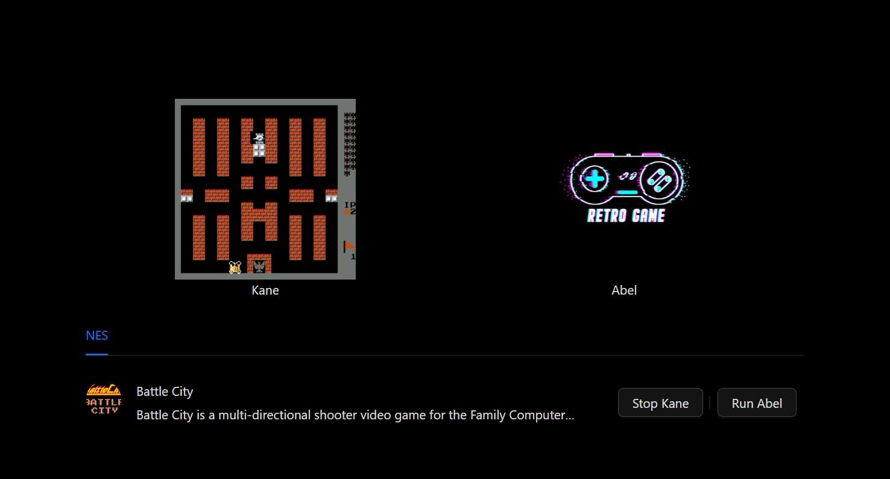

# AI Play Retro Game

## Running

About windows platform, you must be running in WSL2.

```bash
cd backend
uvicorn main:app --reload
```

## Train model

```bash
cd backend
python train.py game-name
```

## Screenshots


